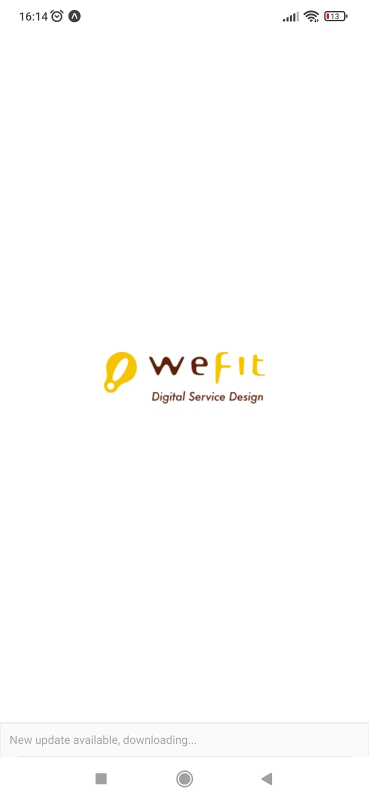
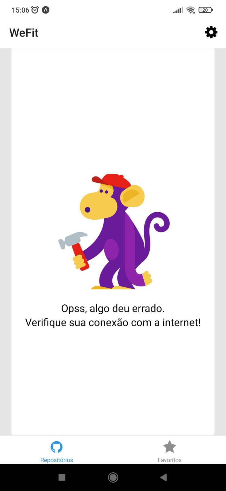
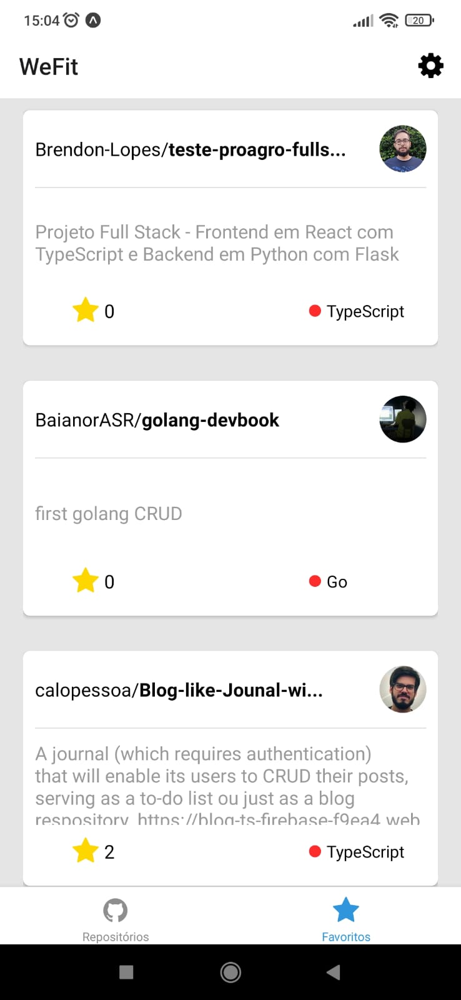

# WeFit Github Explorer

  

    
    
    
  

 

## 💻 Projeto

A ideia desse aplicativo é ser um explorador de repositórios do github, sendo possível salvar repositórios e vê-los detalhadamente na página web!

 

## 🚀 Tecnologias

Esse projeto foi desenvolvido com as seguintes tecnologias:

Mobile:

> Expo, React Native com Typescript, Prettier, Axios, React Native Webview, entre outros...

Backend:

> -Foi utilizada uma API externa disponibilizada pelo github-

## ⬇️ Instalando dependências

Após clonar o projeto:

`npm install`

### ⬇️ Depois de instaladas as dependências:

`npm start`

#### Por padrão uma porta irá abrir na url: http://localhost:3000

 

## 📌 Habilidades

Nesse projeto, fui capaz de:

- Aprimorar minhas habilidades com o React Native
- Utilizar o axios para fazer solicitações a API externa do github
- Aprimorar minha organização de código
- Utilizar o React Native Webview para carregar sites externos dentro do meu app

 

## 📝 Ajustes e melhorias

O projeto possui melhorias pendentes, e possíveis atualizações serão voltadas nas seguintes tarefas:

- [ ] Ao selecionar um usuário, poderia haver um histórico de últimas pesquisas!
- [ ] Poderiam ter animações em diversos cards!
- [ ] Outras abas para navegar com dados mais detalhados dos repositórios e do usuário!
- [ ] Desenvolver testes unitários para toda a aplicação!

 

## 🚩 Desenvolvimento

 

#### Ao entrar no aplicativo o usuário chega na tela de repositórios, se não houver nenhum nome de usuário setado, por padrão será carregado o 'appswefit', essa escolha ode ser alterada na engrenagem no topo direito da tela nessa tela o usuário pode navegar por uma Flatlist com diversos cards detalhando cada um dos repositórios do usuário escolhido!

 

#### Se um card for favoritado, ele irá para aba de Favoritos, saindo assim da tela de Repositórios, ao clicar em um card em qualquer das telas, será redirecionado para tela de detalhes daquele card, e logo abaixo é possível abrir seu link diretamente na página do github, ou favoritar/desfavoritar o mesmo!

 

#### O usuário que acessar o aplicativo sem internet verá uma mensagem de erro na tela de Repositórios, mas poderá acessar normalmente a tela de Favoritos, que foram salvos no estado localmente!

 

## 🔗 Links & referências

> Projeto: https://github.com/JoaumVictor/repositories-project-wefit

> Github: https://github.com/JoaumVictor

> Linkedin: https://www.linkedin.com/in/victorfausto/

> Email: joaumvictor.oficial@gmail.com
